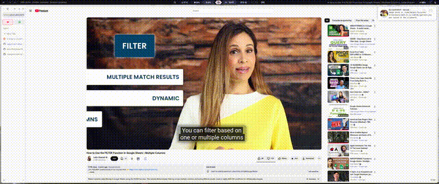

# MargotOS

## My personal NixOS configuration

[based off of ZaneyOS's config](https://gitlab.com/Zaney/zaneyos)
[Bar is Mechabar](https://github.com/sejjy/mechabar)

[Which is based on Waybar](https://github.com/Alexays/Waybar)
[Theme is Rose Pine Dawn](https://github.com/edunfelt/base16-rose-pine-scheme)

